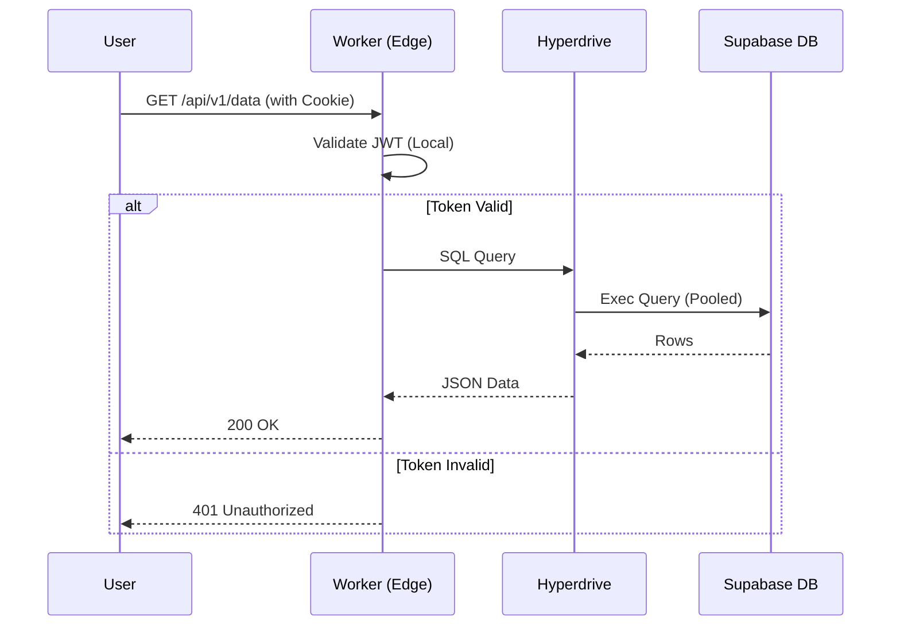

# Technical Design: 03-edge-infra (Edge Infrastructure Migration)

## 1. Architecture Decisions

### AD-01: Usage of Cloudflare Hyperdrive
- **Decision**: Use Hyperdrive for all Postgres connections from Workers.
- **Rationale**: Direct connections to Postgres from a distributed Edge environment can quickly exhaust connection limits and suffer from high latency due to the TCP/TLS handshake. Hyperdrive pools these connections at the edge.
- **Trade-off**: Requires a direct DB connection string (not pgbouncer), but the benefits in performance outweigh the setup complexity.

### AD-02: Local JWT Verification
- **Decision**: Verify Supabase JWTs locally in the Worker using the `JWT_SECRET`.
- **Rationale**: Going back to Supabase Auth (`/user`) on every request adds 100-200ms of latency. Local verification is near-instant.
- **Security**: The secret must be stored as a `wrangler secret` and never exposed.

## 2. Infrastructure Components

### 2.1 The "Edge Orchestrator" Worker
A new Cloudflare Worker project that will act as the gateway for all heavy logic.
- **Runtime**: `service-worker` or `modules` (preferred).
- **Tooling**: `wrangler` for deployment and CI/CD.
- **Dependencies**: `supabase-js` (core), `pg` (optional if using Hyperdrive directly).

### 2.2 Shared Libraries
We will extract some logic from the Next.js app to be shared with the Worker:
- **Types**: Shared TypeScript interfaces for DB schema and AI responses.
- **Constants**: Shared model IDs and configuration keys.

## 3. Sequence Diagrams

### 3.1 Authenticated Data Fetching

## 4. Implementation Strategy

### Phase 1: Local Simulation
1. Use `wrangler dev` with local postgres to simulate the environment.
2. Verify that JWT validation works with locally generated tokens.

### Phase 2: Hyperdrive Bootstrap
1. Configure Hyperdrive via CLI or Dashboard.
2. Bind the Hyperdrive ID to the Worker in `wrangler.toml`.

### Phase 3: Gradual Routing
1. Route specific API endpoints (e.g. `/api/ai/*`) to the Cloudflare Worker using **Cloudflare Routes** or a reverse proxy.
