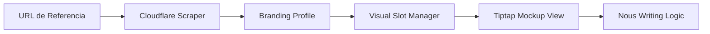

# Technical Design: 04-sentient-layout (Tiptap Visual Bridge)

## 1. Concepto: El Editor como Lienzo (Canvas-Mode)
En lugar de un editor de texto centrado en una columna, Tiptap se encapsula en una estructura de "Mockup Dinámico" que hereda los estilos del proyeto.

## 2. Arquitectura de Componentes

### 2.1 Editor Wrapper (`ImmersivePreview`)
Un componente React que envuelve al `EditorContent` de Tiptap. 
- **Props**: Recibe el `BrandingProfile`.
- **Efecto**: Inyecta variables CSS en el scope del editor: `--editor-font`, `--editor-primary`, `--editor-max-width`.

### 2.2 Extensiones Custom de Tiptap
- **`LayoutBlock`**: Un nodo de tipo "block" que puede contener otros nodos y tiene metadatos de disposición (ej. `float: left`, `width: 50%`).
- **`WidgetPlaceholder`**: Nodo interactivo que representa un widget del CMS real. Permite configurar el "Extractor Nous" o un snippet de código directamente desde el editor.

## 3. Lógica de Maquetación Automática (IA Integration)
Cuando Nous genera el contenido en modo "Auto" o basado en una "Plantilla":
1. **El Outline Generator** define los puntos de anclaje (slots).
2. **El Redactor** escribe el texto validando que no exceda el espacio del slot.
3. **El Image Generator** crea imágenes con el ratio exacto del slot.
4. **El Layout Engine** inserta los nodos en Tiptap en orden **Bottom-Up** (para preservar índices).

## 4. Diagrama de Flujo: Creación de Plantilla Visual

## 5. Estrategia de Persistencia
- Las plantillas se guardan en `projects.settings.design.templates` (JSONB).
- El contenido maquetado se guarda como JSON de Tiptap, preservando los atributos de layout en los nodos.
