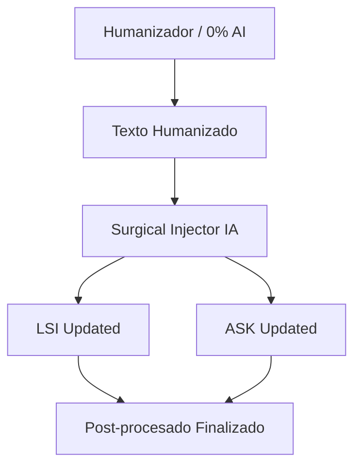

# Technical Design: 05-nous-studio-v3 (Studio Infrastructure)

## 1. Arquitectura del Scraper de Pureza (Optimizado Cloudflare)

### 1.1 Pipeline de Destilación (Doble Fase)
Para evitar el consumo masivo de red y cómputo bajando HTML basura, la extracción se divide en dos fases:

#### Fase A: Reconocimiento Liviano (Edge)
1. **Fetch (Cloudflare Browser Rendering)**: El Edge carga las URLs.
2. **Injected Script (Puppeteer)**: Se ejecuta JavaScript nativo en el navegador *headless* que **solo cuenta palabras** (`document.body.innerText.split(/\s+/).length`) y extrae la estructura de encabezados (`h1`, `h2`, `h3`).
3. **Retorno**: Un JSON minúsculo (`{ wordCount, headers }`).
4. **Filtro Automático**: Supabase descarta todo lo que tenga `< 300` palabras o errores 4xx/5xx instantáneamente.

#### Fase B: Extracción Profunda (Solo Ganadoras)
1. Para las URLs que sobreviven (ej. 30 de 120), Cloudflare vuelve a entrar y extrae **únicamente el contenido limpio** (el DOM dentro de `<article>` o `<main>`).
2. Se limpian menús, footers y banners.
3. El HTML limpio (no el dom completo) se envía al LLM de Filtrado Cognitivo (Gemini/Groq) junto con el H1 y la Intención de Búsqueda generados en paralelo.

### 1.2 Parallel Execution Strategy
Utilizaremos `Promise.allSettled` para procesar los lotes de URLs en Supabase Edge Functions. El H1 y la Intención de Búsqueda se generan asincrónicamente con Serper y Gemini/Groq mientras Cloudflare hace el Reconocimiento Liviano.

## 2. Tiptap Studio Bridge (Floating UI)

### 2.1 Floating Menu Implementation
Un nuevo componente de UI `StudioFloatingOutline` encapsulará el estado del menú contextual. 
- **Librería de Animación**: `@chenglou/pretext` para la recolección de letras.
- **State Management**: Zustand manejará el segmento activo y el progreso de la redacción.

### 2.2 Surgical Keyword Injection (Logic)
Un motor de "Búsqueda y Reemplazo Semántico":
1. Identifica oraciones que contienen sinónimos de la LSI/ASK objetivo.
2. Evalúa si el reemplazo mantiene la naturalidad (probabilidad probabilística).
3. Inserta la keyword sin alterar la puntuación ni la estructura gramatical pesada.

## 3. Diagrama de Flujo: Post-procesado SEO

## 4. Métricas Visuales (Bullet Graphs)
Implementación de micro-gráficos SVG para las métricas LSI/ASK:
- **Barra de fondo**: Representa el 150% (Rojo).
- **Rango óptimo**: Sombreado verde/amarillo.
- **Marcador actual**: Línea negra que se desplaza según el conteo real detectado por Regex en el editor.
