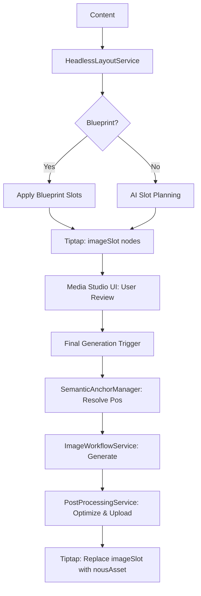

# Design: senior-layout-engine

## Technical Approach

The "senior-layout-engine" transforms the image generation system from a paragraph-based approach to a professional, layout-aware design pipeline. The core strategy is to decouple the **intent** (design planning) from the **execution** (image generation and processing) through a Headless Layout Service and a robust semantic anchoring system.

The system introduces an "Editorial Director" flow:
1. **Analysis**: `HeadlessLayoutService` analyzes content and applies a `Blueprint`.
2. **Slot Planning**: AI suggests `imageSlot` nodes with `LayoutRole` and `SemanticAnchors`.
3. **User Adjustment**: User refines slots via the `Media Studio UI`.
4. **Final Generation**: The system resolves anchors, generates images based on roles, and processes them through a parallelized pipeline.

## Architecture Decisions

| Decision | Choice | Alternatives | Rationale |
|----------|--------|--------------|------------|
| **Positioning** | Semantic Anchoring | Paragraph Index | Paragraph indices are fragile; semantic anchors survive content edits and humanization. |
| **Matching** | Fuzzy Match (Levenshtein) | Exact Match | Ensures robustness against minor linguistic changes during humanization/translation. |
| **Architecture** | Headless Service | UI-coupled logic | Enables batch processing of articles without a browser, separating layout logic from presentation. |
| **Export** | Screaming HTML (Inline CSS) | External CSS/Classes | Guarantees 1:1 layout fidelity when pasting into external CMS (WordPress/Shopify). |
| **Processing** | Binary Search Quality | Linear Reduction | Faster and more precise convergence to the target `max_kb` limit. |
| **Uploads** | Parallel `allSettled` | Sequential `await` | Dramatically reduces total pipeline time for articles with multiple assets. |

## Data Flow



## File Changes

| File | Action | Description |
|------|--------|-------------|
| `src/lib/services/layout/HeadlessLayoutService.ts` | Create | Main orchestrator for analysis, planning, and batch processing. |
| `src/lib/services/layout/SemanticAnchorManager.ts` | Create | Logic for anchor extraction, fuzzy matching, and orphan handling. |
| `src/lib/services/image/PostProcessingService.ts` | Create | Sharp pipeline: resize $\rightarrow$ watermark $\rightarrow$ binary search WebP $\rightarrow$ upload. |
| `src/lib/tiptap/nodes/ImageSlot.ts` | Create | Placeholder node with attributes: `layoutRole`, `promptHint`, `anchorPhrase`, `status`. |
| `src/lib/tiptap/nodes/NousAsset.ts` | Modify | Update `renderHTML` to output inline CSS for `align`, `wrapping`, and `width`. |
| `src/lib/services/writer/image-workflow.ts` | Modify | Integrate `HeadlessLayoutService` and parallelize `persistImages`. |
| `src/lib/services/imagePlanningService.ts` | Modify | Update prompts to return semantic anchors and `LayoutRole`. |
| `src/components/contents/writer/MediaTab.tsx` | Modify | Refactor as Container: syncs Tiptap slots with the Media Studio state. |
| `src/components/contents/writer/AssetGrid.tsx` | Create | Presentational: renders a grid of `AssetCard` components. |
| `src/components/contents/writer/AssetCard.tsx` | Create | Presentational: state-based UI (Ghost, Final, Error). |
| `src/components/contents/writer/ImageInspector.tsx` | Create | Presentational: detail panel for precision attribute overrides. |

## Interfaces / Contracts

### Layout Role & State
```typescript
enum LayoutRole {
  HERO = 'HERO',       // Cinematic, wide, high impact
  ICON = 'ICON',       // Small, centered subject, white bg, for lists
  FEATURE = 'FEATURE', // Medium size, detailed, illustrative
  INFO = 'INFO'        // Diagrams, screenshots, data-driven
}

interface ImageSlotAttributes {
  layoutRole: LayoutRole;
  promptHint: string;
  anchorPhrase: string;
  status: 'pending' | 'generating' | 'final' | 'orphaned';
  width?: string;       // e.g., '50%'
  align?: 'left' | 'right' | 'center';
  wrapping?: 'tight' | 'square';
}
```

### Headless Layout Service
```typescript
interface HeadlessLayoutService {
  planLayout(content: string, blueprint?: Blueprint): Promise<PlannedSlot[]>;
  resolveAndPlace(editor: Editor, slots: PlannedSlot[]): Promise<PlacementResult>;
  processBatch(articles: Article[]): Promise<BatchResult>;
}
```

## Testing Strategy

| Layer | What to Test | Approach |
|-------|-------------|----------|
| Unit | `SemanticAnchorManager` | Test fuzzy matching with various humanized strings and anchor deletions. |
| Unit | `PostProcessingService` | Test binary search quality convergence against `max_kb` targets. |
| Integration | `HeadlessLayoutService` | End-to-end flow: Content $\rightarrow$ Slots $\rightarrow$ Generation $\rightarrow$ Placement. |
| E2E | Media Studio UI | Verify that editing an attribute in `ImageInspector` updates the `imageSlot` in Tiptap. |
| E2E | HTML Export | Verify exported HTML maintains layout in an external browser environment. |

## Migration / Rollout

- **Phase 1**: Implement `HeadlessLayoutService` and `SemanticAnchorManager`.
- **Phase 2**: Introduce `imageSlot` and update `nousAsset` rendering.
- **Phase 3**: Deploy `PostProcessingService` and parallel uploads.
- **Phase 4**: Roll out Media Studio UI.
- **Compatibility**: Existing `nousAsset` nodes using `paragraphIndex` will remain functional as a fallback.

## Open Questions

- [ ] Should we implement a maximum concurrency limit for the `PostProcessingService` (e.g., 5) to avoid Supabase rate limits? (Proposed: Yes)
- [ ] Do we need to support custom `LayoutRole` definitions per project, or is the global enum sufficient? (Proposed: Global enum for now)
