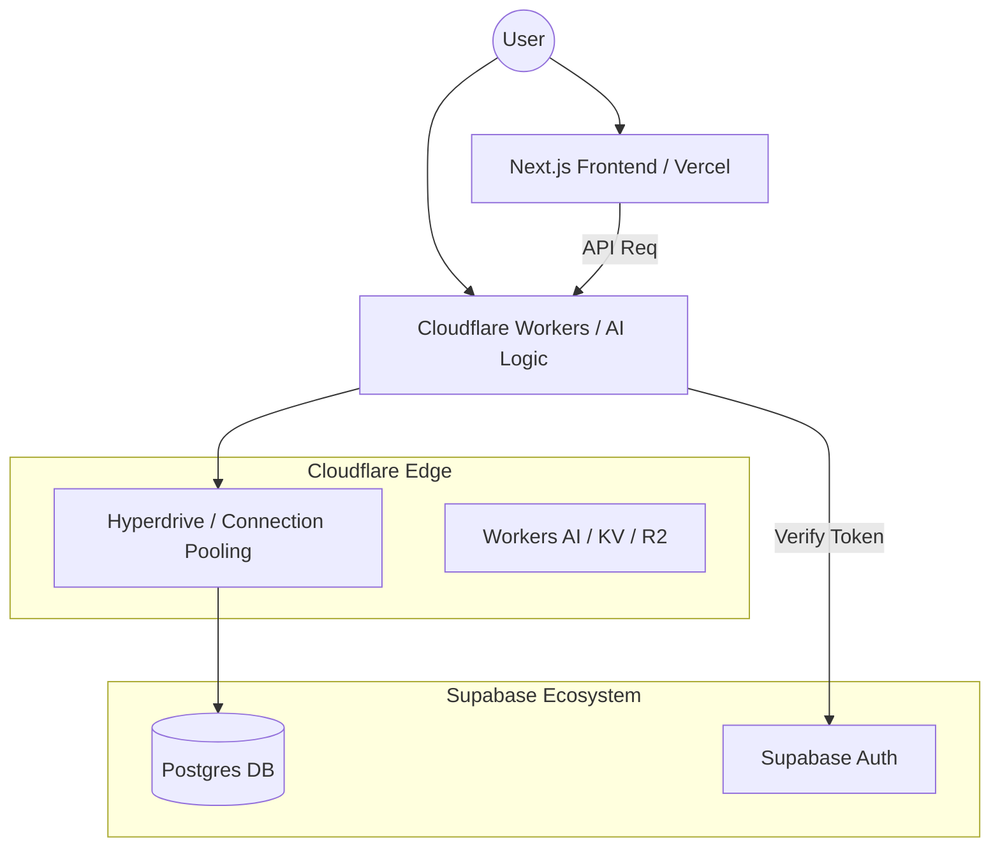

# 🏛️ Master Plan: "Edge Cathedral" - Cloudflare & Supabase Migration

Este documento es el Plano Maestro para la migración masiva de la infraestructura de backend de **Nous 2.0** a una arquitectura Edge de alto rendimiento.

## 1. Visión y Objetivos
Migrar de un modelo tradicional basado en rutas de API en Vercel a una **Ejecución Global en el Edge** utilizando Cloudflare Workers.

### Objetivos Principales
- **Latencia Cero**: Pool de conexiones con Cloudflare Hyperdrive.
- **Eficiencia de Costos**: Mover el procesamiento pesado de IA a Workers.
- **Escalabilidad Global**: Lógica de IA ejecutada en el nodo más cercano al usuario.
- **Contexto de Auth Compartido**: Verificación fluida entre Next.js (Frontend) y Workers.

## 2. Arquitectura Técnica

## 3. Fases de Implementación

### Fase 1: Cimientos (The Quarry)
1. **Integración Supabase + Cloudflare**: Conectar cuentas mediante el dashboard oficial.
2. **Configuración de Hyperdrive**: 
   - Extraer strings de conexión directa.
   - Crear configuración de Hyperdrive con `wrangler`.
3. **Sincronización de Entorno**: Mapear secretos `SUPABASE_URL` y `SERVICE_ROLE_KEY`.

### Fase 2: Desacoplamiento de Lógica (The Scaffolding)
1. **Migración del AI Core**: Mover `executeWithKeyRotation` y jerarquías de modelos a un Worker dedicado.
2. **Implementación de Auth Compartido**: 
   - Verificación de JWT en el Edge.
   - Uso de `@supabase/ssr` compatible con Workers.

### Fase 3: Persistencia de Datos (The Altar)
1. **Caching Dinámico**: Usar Cloudflare KV o Cache API para resultados de IA.
2. **Optimización de Hyperdrive**: Monitoreo de latencia y carga de DB.

---
*Senior Architect: Antigravity AI (Gentleman Class)*
